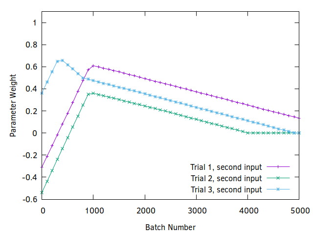
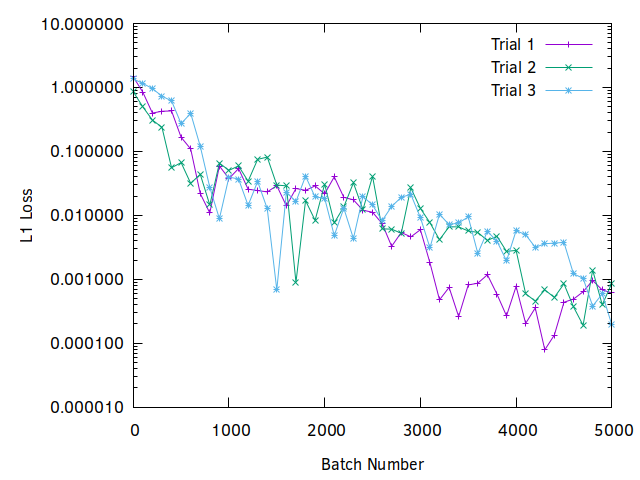
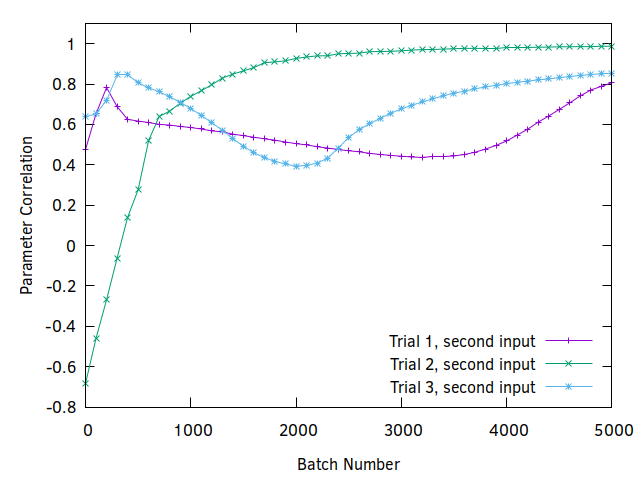
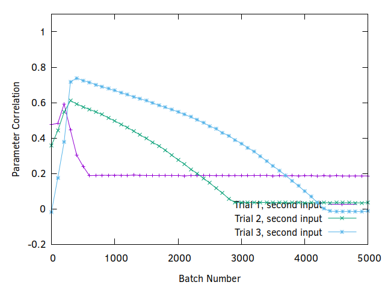

# The Overfitting "Myth"

It is general wisdom that training for too many iterations on your data will lead to a model
*overfitting* to you training data. This then causes worse performance on your evaluation data. This
is a misconception. If your training data and testing data are drawn from the same distribution then
there cannot be overfitting. This obviously holds true if we have an unlimited amount of training
data, but it may seem that a limited amount of training data may have a few outliers that degrade
the quality of a model by causing strange parameter optimizations to accommodate those point.
However, if those outliers represent the true distribution of the data then there is nothing wrong
with your model adapting to put them on the correct side of some decision boundary.

This is actually especially true for models with an excessive amount of free parameters. They are
free to make tiny "bubbles" within their parameter space to shepherd those lone outlier points into
the correct output without accidentally including nearby points from the incorrect distribution.
This stand in contrast to some other approaches, such as SVMs, which are more sensitive to outliers
and where the decision boundaries cannot easily isolate single outlier points 

# Experimental Setup

The *basic_detector.py* will let us quickly explore some ideas about network fitting. For example,
if we wanted to see how well a neural network would learn a situation with one signal that was
perfectly correlated with a desired about and another signal that was present 50% of the time when
the signal was present and 50% of the time when the signal was not present we would run:

> python3 fitter.py --correlations 1.0 0.5 --anticorrelations 0.0 0.5

This would create a network with one linear layer that directly maps two inputs to a single output.
After 5000 iterations of batch size 32 we get:

> Batch 5000 loss is 0.00034125553793273866
> At batch 5000 layer 0 has weights [0.9997571110725403, -0.0004018025647383183] and bias -0.00018702048691920936
(Keep in mind that we are not doing anything to achieve determinism so you may get different results.)

Loss is the L1 loss, the absolute difference between the target value, 0 or 1, and the output of the
network. The weights show that the network has learned to directly map the first input to the output
(the 0.9997.... weight) and ignore the second input. This is correct.

If we add more layers:

> python3 fitter.py --correlations 1.0 0.5 --anticorrelations 0.0 0.5 --layers 3

The *--layers* option allows the user to specify an arbitrary number of linear layers. All but
the last linear layer will be followed with a *ReLU* layer.

Examining the weights gives a less clear picture of results when there are multiple layers, so
instead we probe the network by setting one input to `1` the other inputs to `0` and checking the
output. We observe these results:

> Batch 5000 loss is 0.00021663540974259377
> At batch 5000 input 0 has correlation 1.0004584789276123
> At batch 5000 input 1 has correlation -0.00017554312944412231

Again, this seems correct.

The program has the following additional options:

*--dropout*: Enable dropout after the first ReLU.
*--expand*: Double layer size with each linear layer.

# Spurious correlations

The concerns about overfitting often have to do with a network learning a spurious signal, one that
only occurs in the training data but not in the validation data or real world. We could represent
that with this trial:

> python3 fitter.py --correlations 1.0 0.8 --anticorrelations 0.0 0.0

Here a spurious signal shows up 80% percent of the time the network is expected to have a detection.
To an intelligent observer we can see that the first input is both necessary and sufficient to
predict the output and the second parameter should be ignored.

Running the above command three times yields these loss curves:

The first trial looks like it gets stuck at some point, but if we look at the actual weights for the
first and second input we can see that they are moving in the correct direction and would eventually
get to their correct values (0 and 1 respectively).

| First Weight | Second Weight  |
| :---:        |     :---:      |
|  |      |

It is important to notice that the weights do move in the wrong direction in the beginning. The
weights for input 2 start off by moving towards 1 before reversing and moving towards 0. This has to
do with how long it takes for the weights from the first input be correlate it with the output.
Imagine that these two inputs are actually outputs from several convolution layers serving as a
feature extractor. If the spurious signal is for some reason easier for the convolutions to detect
than the desired signal then the neural network will look like it is learning the wrong thing
quickly in early training epochs. With enough time however, the desired signal is better correlated
with the output and the network will converge to the desired solution. A risk of early stopping
during training based upon a fear of overfitting rather than an observed plateau in performance is that the network has not yet converged and incorrect correlations still exist.

A three layer network shows similar results in loss and input correlation, but with an important
difference:

> python3 fitter.py --layers 3 --correlations 1.0 0.8 --anticorrelations 0.0 0.0

| Loss | First Input Correlation | Second Input Correlation |
| :---:        |     :---:      |         :---: |
|  |  |  |

Here note that the correlation of the second variable is somewhat arbitrary. That is because with a
more complicated network structure there is no reason to force the correlation to 0. One knee-jerk
reaction here is to add dropout to break the correlation. Doing that we get this disaster:

> python3 fitter.py --layers 3 --correlations 1.0 0.8 --anticorrelations 0.0 0.0 --dropout 1

| Loss | First Input Correlation | Second Input Correlation |
| :---:        |     :---:      |         :---: |
|  |  |  |

Now the correlation of the unnecessary variable is even stronger.  Is this evidence of the
overfitting problem of deep neural networks? No! This is evidence that we are making some big
mistakes. The two inputs are always correlated in the training data, and with dropout the network
must lean on the second input to deduce the state of the first at times, so it fails to learn the 1
to 1 relationship between the first input and the output and cannot ignore the second input.

So what is the correct approach to take if all of our training data has some bad correlation that we
want to break? Something that may come to mind is to add some negative examples. Let's try fixing
the data just a little bit but adding a few negative examples for input 2:

> python3 fitter.py --layers 3 --correlations 1.0 0.8 --anticorrelations 0.0 0.001

| Loss | First Input Correlation | Second Input Correlation |
| :---:        |     :---:      |         :---: |
|  |  |  |

The correlation of the first input at least goes to 1, although we don't always get the correlation
of the second input to go to 0. In fact it sometimes goes negative, which is also undesireable
because the correct solution should just ignore the second input.

What is actually going wrong here is that we are getting greedy. You can read some papers that go
into some theory of what is going on during gradient descent ([here for example](http://proceedings.mlr.press/v40/Choromanska15.pdf)), but basically convergence of a neural network is only guaranteed if our effective learning rate is low enough. Even though overly-large neural networks have many local minima our experience shows that they are all roughly equivalent so in practice there should be no concern about falling into the "wrong" minima of the loss surface.

Let's just trust that gradient descent is fantastic and make the batch size much larger. We'll also
need to train for a longer time because making the batch size larger effectively lowers the learning
rate.

First without the anti-correlation:
> python3 fitter.py --layers 3 --correlations 1.0 0.8 --anticorrelations 0.0 0.0 --batch_size 512 --batches 10000

| Loss | First Input Correlation | Second Input Correlation |
| :---:        |     :---:      |         :---: |
|  |  |  |

Now with the anti-correlation:
> python3 fitter.py --layers 3 --correlations 1.0 0.8 --anticorrelations 0.0 0.001 --batch_size 512 --batches 10000

| Loss | First Input Correlation | Second Input Correlation |
| :---:        |     :---:      |         :---: |
|  |  |  |

The results aren't fundamentally different than they were before, but now convergence is much
better. Without a negative correlation there is a chance that the network will learn some
correlation to something that is positively correlated but unecessary. This is the "overfitting"
problem that seems to cause a lot of lost sleep, but with even a small anticorrelation this will not
happen.

Neural networks are not magic, we should not expect that we can just turn a crank with any trashy
input data and expect gold to come out.

